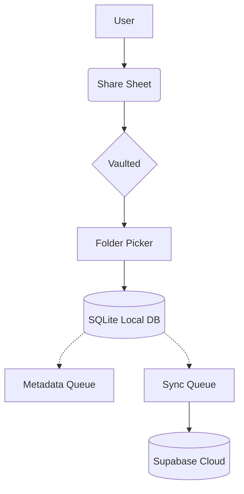

  
  <h1>Vaulted</h1>
  **Your Universal Personal Knowledge Library**

  Vaulted is an offline-first, cross-platform personal knowledge library designed to rescue the content you learn from social media and the web. It centralizes, organizes, and enriches your saved content, ensuring that what you find today is never lost tomorrow.

  
  
  
  
  
  
  

   

  **🚀 Save from any platform &nbsp; • &nbsp; 📚 Organize everything in one place &nbsp; • &nbsp; 🔍 Find anything—even offline**

---

## 🛑 The Problem

We live in a golden age of short-form educational content. TikTok, YouTube Shorts, Instagram Reels, and Facebook Reels are packed with incredible insights, tutorials, and inspiration. 

But saving this content is fundamentally broken:
- **Platform Lock-in:** Saved lists are trapped inside the app where the content was found.
- **Knowledge Fragmentation:** You can never remember if that recipe was saved on Instagram, TikTok, or sent to a friend.
- **The "Self-Chat" Dump:** People resort to messaging themselves links, creating chaotic, unsearchable dumping grounds.
- **Impossible Rediscovery:** Even if you remember saving it, finding a specific video from 6 months ago is practically impossible.

What should be a curated personal library quickly devolves into a digital graveyard.

## 💡 The Solution

**Vaulted** is an offline-first personal knowledge library built for the modern internet. 

Instead of relying on fragmented platform bookmark systems, you use the native OS Share Sheet to send any link, video, or article directly to Vaulted. Inside Vaulted, you can categorize items into custom **Folders**, add personal **Notes**, apply **Tags**, and enjoy automatic **Metadata enrichment** (thumbnails, titles, descriptions). 

Because Vaulted is built with an offline-first architecture, everything you save is instantly indexed and searchable without an internet connection. Vaulted breaks down the walls of platform silos, turning fleeting content into a permanent, organized, and easily accessible knowledge base.

## ⏱️ Why Now?

The consumption of short-form educational content is exploding. Users are increasingly turning to social media to learn new skills, discover tools, and gather inspiration. However, the tools to manage this cross-platform consumption haven't evolved. 

As knowledge overload increases, the need for a unified, platform-agnostic organization system has never been more urgent. Users are desperate for a way to own their curation.

## 🎯 Target Audience

| Audience | Use Case |
|----------|----------|
| **Students** | Organizing study materials, tutorials, and research links for assignments. |
| **Developers** | Saving code snippets, architecture breakdowns, and tech talks from YouTube/X. |
| **Professionals** | Curating industry news, productivity hacks, and career advice. |
| **Researchers** | Collecting cross-platform sources and adding personal context via notes. |
| **Creators** | Saving inspiration, editing tutorials, and trend references. |
| **Lifelong Learners**| Building a permanent library of recipes, DIY projects, and personal interests. |

## ✨ Core Features

### 📥 Capture
- **Universal Share Sheet:** Intercept links natively from any app.
- **Android Share Intent & iOS Share Extension:** Deeply integrated into the OS.
- **Instant Save:** Fire-and-forget saving without disrupting your scrolling.

### 🗂️ Organization
- **Folders:** Create custom hierarchies with colors and icons.
- **Tags & Notes:** Add personal context to every saved item.
- **Favorites & Archive:** Keep your active workspace clean.
- **Duplicate Detection & Canonical URLs:** Never save the same content twice.

### 🔍 Discovery
- **Offline Search:** Instant, full-text SQLite FTS5 search across titles, notes, and tags.
- **Rich Metadata:** Background jobs fetch titles, descriptions, and thumbnails.
- **Fast Lookup:** Time-ordered UUIDv7 architecture for lightning-fast disk reads.

### 🛡️ Reliability
- **Offline-first (Organization, not Media):** The core database lives on your device. You can search, organize, and browse your library instantly offline. *(Note: Vaulted organizes links, it does not download actual video/media files for offline playback).*
- **Background Sync:** The `SyncQueue` ensures mutations safely reach the cloud.
- **Conflict Resolution:** Graceful handling of multi-device edits.
- **Soft Delete:** Accidental deletions are recoverable.

## 🔄 Product Workflow

## 🏗️ Architecture Overview

Vaulted is engineered for resilience and speed, adhering strictly to **Clean Architecture** principles and a **Feature First** directory structure. 

The application is unapologetically **Offline First**. The UI only ever reads from and writes to the local SQLite database. A robust **Repository Pattern** and **Service Layer** decouple the application logic from data sources. All network writes are logged to a local **Sync Queue** which processes mutations in the background when connectivity allows, ensuring a completely uninterrupted user experience.

*For complete technical details, refer to [`docs/architecture.md`](docs/architecture.md).*

## 🛠️ Technology Stack

| Category | Technology |
|----------|------------|
| **Frontend** | Flutter (Dart) |
| **Backend / Cloud** | Supabase (PostgreSQL) |
| **Local Database** | SQLite (via Drift), FTS5 |
| **State Management** | Riverpod |
| **Networking** | Dio |
| **Authentication** | Supabase Auth |
| **Architecture** | Clean Architecture (Feature First) |
| **Monetization** | RevenueCat (Planned) |
| **Testing** | Flutter Test, Mocktail |

## 🏆 Competitive Advantages

| Feature | Vaulted | Platform Saved Lists | Browser Bookmarks | Notion | Pocket |
|---------|:---:|:---:|:---:|:---:|:---:|
| **Offline First** | ✅ | ❌ | ⚠️ | ❌ | ✅ |
| **Cross-Platform** | ✅ | ❌ | ✅ | ✅ | ✅ |
| **Custom Folders**| ✅ | ⚠️ | ✅ | ✅ | ❌ |
| **Custom Tags** | ✅ | ❌ | ❌ | ✅ | ✅ |
| **Personal Notes**| ✅ | ❌ | ❌ | ✅ | ❌ |
| **Instant Search**| ✅ | ❌ | ⚠️ | ⚠️ | ⚠️ |
| **Share Sheet** | ✅ | ❌ | ⚠️ | ✅ | ✅ |
| **AI Ready** | ✅ | ❌ | ❌ | ✅ | ❌ |

## 💼 Business Model

Vaulted follows a freemium model designed for organic adoption with a clear upgrade path for power users.

### Free Tier
- Up to 5 custom folders
- Unlimited saved content
- Offline search
- Basic organization (Favorites, Archive)

### Premium *(Planned)*
- Unlimited folders
- Advanced organization (Tags, Sub-folders)
- Cross-device cloud sync
- Priority support and early access features
- Advanced AI Features

## 🚀 Go-To-Market Strategy

Vaulted will rely heavily on organic growth and community evangelism. 
- **Initial Audience:** Tech-savvy students, developers, and productivity enthusiasts.
- **Communities:** University Discord servers, Reddit (r/productivity, r/FlutterDev), and GitHub.
- **Launch Platforms:** Product Hunt and Hacker News.
- **Word of Mouth:** "Hey, how do you save your TikToks?" will become a primary growth engine.

## 🗺️ Development Roadmap

| Phase | Status | Description |
|-------|--------|-------------|
| **Phase 0** | ✅ COMPLETE | Project Foundation, Clean Architecture Setup |
| **Phase 1** | ✅ COMPLETE | Local Database (Drift), DAO Layer, Domain Repositories |
| **Phase 2** | ✅ COMPLETE | Supabase Authentication & Profile Sync |
| **Phase 3** | 🏃 IN PROGRESS | Folder Management UI & Logic |
| **Phase 4** | ⏳ PLANNED | Universal Share Sheet & Duplicate Detection |
| **Phase 5** | ⏳ PLANNED | Background Metadata Fetching System |
| **Phase 6** | ⏳ PLANNED | Offline & Remote Full-Text Search |
| **Phase 7** | ⏳ PLANNED | Offline Sync Queue & Conflict Resolution |
| **Phase 8** | ⏳ PLANNED | UI Polish, Animations, Material 3 |
| **Phase 9** | ⏳ PLANNED | Push & Local Notifications |
| **Phase 10** | ⏳ PLANNED | Premium Entitlements & Paywalls (RevenueCat) |
| **Phase 11** | ⏳ PLANNED | User Settings, Data Export, Privacy |
| **Phase 12** | ⏳ PLANNED | Comprehensive Testing, Profiling, Optimization |
| **Phase 13** | ⏳ PLANNED | App Store & Google Play Deployment |

*Refer to [`docs/roadmap.md`](docs/roadmap.md) for the detailed implementation sequence.*

## 🔮 Future Roadmap (V2+) *(Planned)*
- **Desktop Application** (macOS, Windows)
- **Web App Interface**
- **Browser Extensions** (Chrome, Firefox, Safari)
- **Enhanced Content Types** (PDFs, Image OCR, Audio transcriptions)

---

## 🤖 AI Roadmap *(Planned)*

**Note:** Vaulted is *not* an AI-first application. Vaulted is a personal knowledge library. AI serves purely as an intelligence layer built on top of your curated library, designed to help you rediscover, organize, and learn from the content you have explicitly chosen to save.

### AI Summaries
- Automatically summarize saved videos and articles.
- Extract key takeaways and actionable insights without watching a 10-minute video.

### AI Auto Tagging
- Automatically generate tags based on metadata and summaries.
- Suggest categories to keep your library organized.
- Detect duplicated concepts across different platforms.

### Semantic Search
- Natural language search capabilities.
- Examples: *"Find the Flutter video about Riverpod"* or *"Show me everything about investing for beginners"*.

### AI Chat
- Chat directly with your personal library.
- Ask questions and receive answers synthesized exclusively from your saved content.

### AI Study Assistant
- Generate study guides and quizzes from saved educational content.
- Create learning paths grouping related videos and articles.
- Recommend spaced repetition review sessions.

### Smart Collections
- **Continue Learning:** Jump back into partially consumed content.
- **Trending Topics:** See what themes are dominating your recent saves.
- **Unfinished Learning:** Reminders for important links saved months ago.

### Personalized Recommendations
- Suggest related saved content within your vault.
- Recommend folder restructuring and organization improvements to fix knowledge gaps.

---

## 📐 Design Principles

- **Offline First:** It must work in airplane mode. Period.
- **Platform Agnostic:** Content is content, regardless of where it came from.
- **Fast by Default:** Zero loading spinners for local reads.
- **User Controlled:** Your data, your rules.
- **Privacy Conscious:** Analytics are opt-in; content is private.
- **Built for Scale:** The architecture supports 1 link or 100,000 links seamlessly.
- **Knowledge over Algorithms:** Vaulted is an intentional library, not an endless feed.

## 📚 Documentation

- [`docs/architecture.md`](docs/architecture.md) — The strict architectural source of truth for the codebase.
- [`docs/roadmap.md`](docs/roadmap.md) — The sequenced implementation plan and definition of done.

## 📄 License

This project is licensed under the MIT License.

---

  <i>"Our vision is to become the universal personal knowledge library for everything worth remembering, empowering people to capture, organize, and rediscover knowledge regardless of where it originated."</i>

