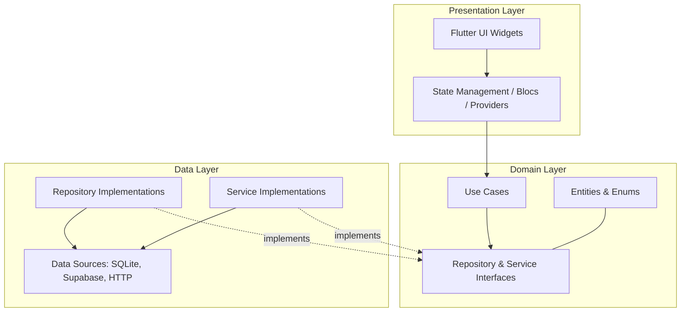
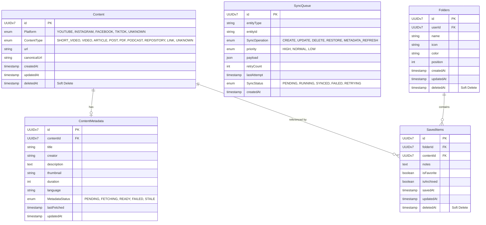
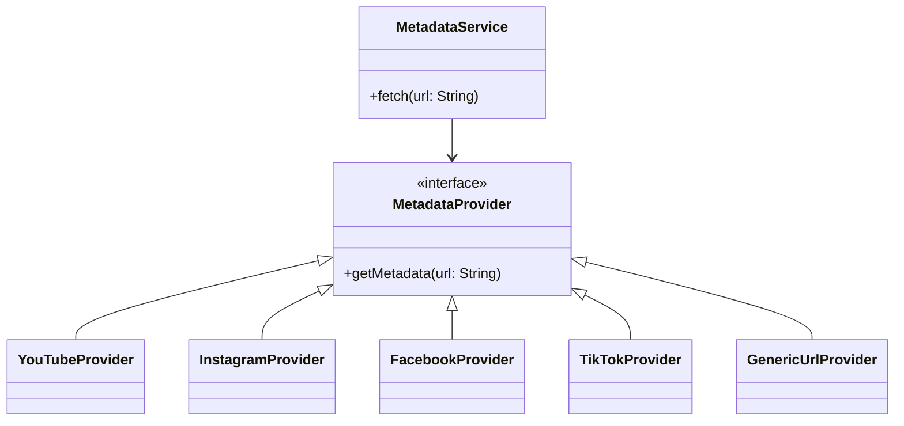
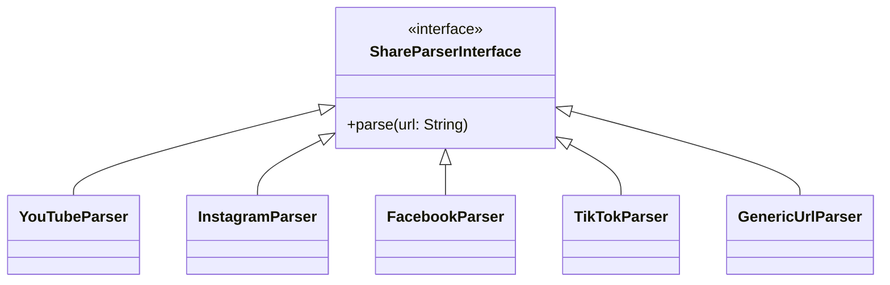
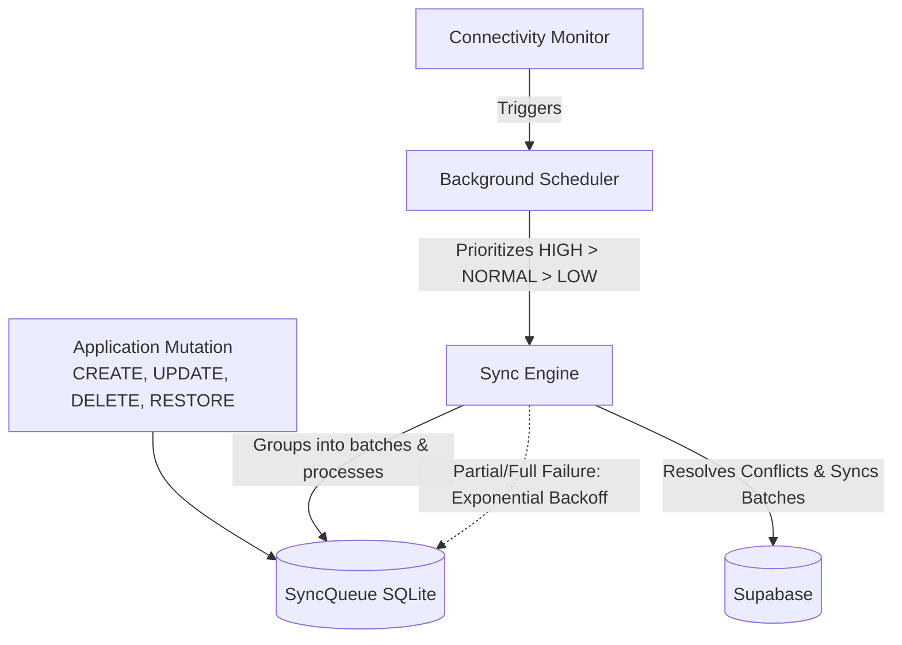

# Revised Architecture Documentation

This document outlines the architectural revisions incorporating the approved production-level improvements. All existing architectural decisions are preserved and augmented with the following structural refinements to ensure internal consistency across schemas, layers, and synchronization flows.

## 1. Clean Architecture & Dependency Rule

The system strictly adheres to Clean Architecture principles. Dependencies always flow inward toward the Domain layer.

*Rule: Presentation and Data layers may depend on Domain, but Domain must NEVER depend on Flutter, Supabase, SQLite, Firebase, or external frameworks.*

## 2. Database Schema & Entity Relationship Diagram (ERD)

The schema reflects the separation of mutable metadata, the introduction of a dedicated Sync Queue, and comprehensive Soft Delete support.

## 3. Repository Layer Restructure

The generic repository approach has been replaced with specialized, focused, and independently testable repositories under the Data Layer:

*   **FolderRepository**: Manages folders and folder hierarchy.
*   **ContentRepository**: Manages immutable content records.
*   **MetadataRepository**: Manages mutable content metadata (`ContentMetadata`).
*   **SearchRepository**: Transparently decides whether to use local search (SQLite FTS5) or remote search (PostgreSQL FTS).
*   **SyncRepository**: Interfaces with the `SyncQueue` for offline/online state reconciliation.
*   **AuthenticationRepository**: Handles user identity and session tokens.

## 4. Service Layer Architecture

Dedicated services under `core/services` enforce single-responsibility principles.

### Core Services
*   **AuthenticationService**: High-level auth workflows.
*   **ShareService**: Orchestrates incoming shared content.
*   **SyncService**: Coordinates background data synchronization.
*   **SearchService**: Orchestrates local/remote search queries.
*   **ConnectivityService**: Monitors network state.
*   **NotificationService**: Handles alerting and background notifications.
*   **RevenueCatService**: Manages subscriptions.
*   **ThumbnailCacheService**: Caches thumbnails locally, expires outdated ones, refreshes automatically, and supports offline viewing. Cached thumbnails are temporary; original images are never permanently duplicated unless explicitly allowed.
*   **DuplicateDetectionService**: Normalizes URLs, generates canonical representations, and searches for existing Content to reuse, preventing any duplicate Content creation.

### Metadata Provider Architecture
Replaces generic metadata workers with a robust provider-based architecture.

*(Future Providers: `GitHubProvider`, `RedditProvider`, `MediumProvider`, `PDFProvider`)*

### Share Parser Architecture
Extracts identifiers and normalizes URLs prior to saving. Every supported platform normalizes URLs to one `canonicalUrl` representation. Duplicate detection uses this canonical URL instead of the original shared URL.

## 5. Offline Sync & Background Synchronization

Every mutation enters the `SyncQueue`. The scheduler always processes higher-priority items first (HIGH > NORMAL > LOW). The Sync Engine groups compatible operations into configurable batches before communicating with Supabase, supporting retry per batch and partial success handling. The UI is never blocked by synchronization tasks.

## 6. Offline Search

Search seamlessly handles offline environments without requiring internet access.

*   **Local Strategy**: SQLite FTS5 provides instant search capabilities.
*   **Remote Strategy**: PostgreSQL Full Text Search handles deep server-side searches.
*   **Execution**: The `SearchRepository` dynamically routes queries based on the `ConnectivityMonitor`.

## 7. Enums & Strong Typing

The application strictly uses strongly typed enums instead of raw strings for critical fields:
*   **Platform**: `YOUTUBE`, `INSTAGRAM`, `FACEBOOK`, `TIKTOK`, `UNKNOWN`
*   **ContentType**: `SHORT_VIDEO`, `VIDEO`, `ARTICLE`, `POST`, `PDF`, `PODCAST`, `REPOSITORY`, `LINK`, `UNKNOWN`
*   **MetadataStatus**: `PENDING`, `FETCHING`, `READY`, `FAILED`, `STALE`
*   **SyncOperation**: `CREATE`, `UPDATE`, `DELETE`, `RESTORE`, `METADATA_REFRESH`
*   **SyncStatus**: `PENDING`, `RUNNING`, `SYNCED`, `FAILED`, `RETRYING`
*   **Priority**: `HIGH`, `NORMAL`, `LOW`
*(Stored as strings in the database, mapped to Enums in the Domain layer)*

## 8. Indexing Strategy

To optimize for recent saves, folder browsing, duplicate detection, offline synchronization, and background scheduling, the following database indexes are implemented:
*   `canonicalUrl`
*   `folderId`
*   `contentId`
*   `savedAt`
*   `deletedAt`
*   `metadataStatus`
*   `SyncQueue.status`
*   `SyncQueue.priority`
*   `SyncQueue.createdAt`

## 9. Scalability Notes

The architecture is explicitly designed for future expansion to support content like Articles, GitHub repositories, Reddit posts, PDFs, Podcasts, and Web pages. Supporting new content types will only require:
1.  A new `MetadataProvider` implementation
2.  A new `ShareParser` implementation
3.  Optional UI changes

No database redesign should ever be required for future content expansions.
